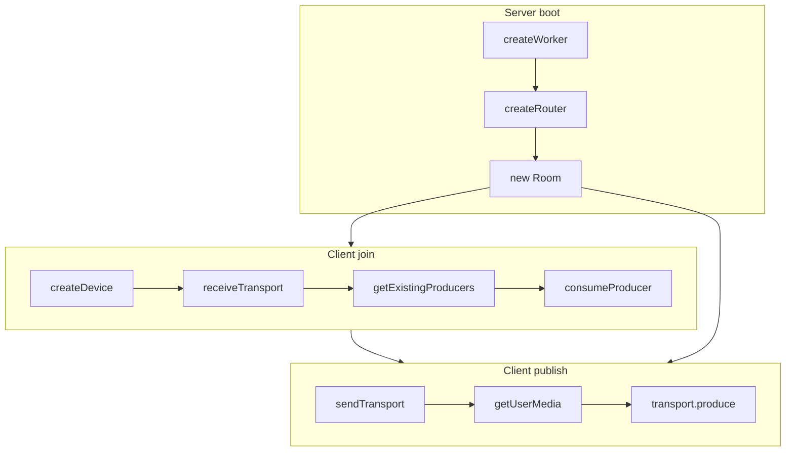
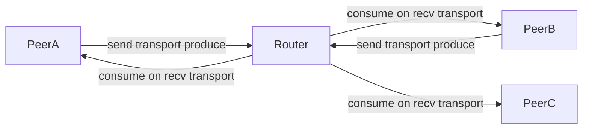

# Mediasoup SFU

A Selective Forwarding Unit (SFU) for multi-peer audio and video. Each client sends media once to the server. The server forwards copies to other peers. Peers never exchange RTP with each other.

Signaling uses Socket.IO. Media uses mediasoup WebRTC transports.

```
client/     React UI + mediasoup-client
server/     Express + Socket.IO + mediasoup worker/router
```

---

## How an SFU is built from these functions

The SFU is not one class. It is a chain of functions that:

1. Create a mediasoup **worker** and **router** (shared media plane).
2. Create a **send transport** per publisher and a **recv transport** per subscriber.
3. **Produce** local tracks on the server, then **consume** those producers on other clients.
4. Keep transports, producers, and consumers in a **Room** so later sockets can look them up.



---

## Function map

### Server media plane

| Function | File | Role in the SFU |
|---|---|---|
| `createWorker` | `server/src/mediasoup/Worker.ts` | Starts the mediasoup process that owns all routers. |
| `createRouter` | `server/src/mediasoup/Router.ts` | Creates the shared router with Opus + VP8. One router = one media namespace for the room. |
| `createWebRtcTransport` | `server/src/mediasoup/transport.ts` | Creates a UDP/TCP ICE transport on the router. Used for both send and recv. |
| `Room` methods | `server/src/index.ts` | Indexes transports, producers, and consumers by id so socket handlers can find them. |

### Server signaling handlers

Each handler is the server half of one SFU step.

| Socket event | What the SFU does |
|---|---|
| `getRtpCapabilities` | Returns router codecs so the client can load a Device. |
| `creteWebRtcTransport` | Calls `createWebRtcTransport`, `room.addTransport`, remembers the transport on this socket. |
| `connectTransport` | `room.getTransport` then `transport.connect` (DTLS). |
| `produce` | `transport.produce`, `room.addProducer`, maps producer → socket, broadcasts `newProducer`. |
| `consume` | Checks `router.canConsume`, creates a paused consumer, `room.addConsumer`. |
| `resumeConsume` | `consumer.resume` and, for video, `requestKeyFrame`. |
| `getProducers` | Lists other peers' producers as `{ producerId, socketId }`. |
| `disconnect` | Closes this socket's producers and transports, emits `producerClosed`. |

### Client media helpers

| Function | File | Role in the SFU |
|---|---|---|
| `createDevice` | `client/src/index.ts` | Loads router RTP capabilities into mediasoup-client. |
| `createTransport` | `client/src/index.ts` | Asks the server for ICE/DTLS params (`creteWebRtcTransport`). |
| `sendTransport` | `client/src/index.ts` | Local send transport. `connect` → `connectTransport`. `produce` → `produce`. |
| `receiveTransport` | `client/src/index.ts` | Local recv transport. `connect` → `connectTransport`. |
| `consumeProducer` | `client/src/index.ts` | `consume` then `resumeConsume`, returns a `MediaStream` with one track. |
| `getExistingProducers` | `client/src/index.ts` | Catch-up list for peers already in the room. |

### Client UI orchestration

| Function | File | Role in the SFU |
|---|---|---|
| `joinRoom` | `client/src/App.tsx` | Device + recv transport + consume everyone already publishing. |
| `startCamera` | `client/src/App.tsx` | `joinRoom` + `sendTransport` + `getUserMedia` + produce video and audio. |
| `mergeTrackIntoPeerStream` | `client/src/App.tsx` | One `MediaStream` per remote `socketId` so audio + video share one tile. |
| `removeRemoteStream` | `client/src/App.tsx` | Stops tracks and removes a peer tile on `producerClosed`. |
| `RemoteVideo` | `client/src/App.tsx` | Plays that peer's merged stream. |

---

## Call sequences

### 1. Server boot

```
createWorker()
  → createRouter(worker)     // Opus audio, VP8 video + RTCP feedback
  → new Room("room-1", router)
  → httpServer.listen(3000)
```

All later transports and producers live on this one router/room.

### 2. Join (subscribe path)

Used on socket `connect` and on **Join Room**.

```
joinRoom()
  → createDevice(socket)
       emit getRtpCapabilities
       device.load({ routerRtpCapabilities })
  → receiveTransport(device, socket)
       createTransport() → emit creteWebRtcTransport
       device.createRecvTransport(params)
       on "connect" → emit connectTransport
  → getExistingProducers(socket)
       emit getProducers
  → for each { producerId, socketId }:
       consumeProducer(...)
         emit consume
         transport.consume(...)
         emit resumeConsume
         return MediaStream with one track
       mergeTrackIntoPeerStream(socketId, track)
```

Result: the joiner can hear/see people who were already publishing.

### 3. Publish (send path)

Used on **Start Camera**.

```
startCamera()
  → joinRoom()                         // ensure device + recv path exist
  → sendTransport(device, socket)
       createTransport() → emit creteWebRtcTransport
       device.createSendTransport(params)
       on "connect" → emit connectTransport
       on "produce" → emit produce → server returns producer id
  → getUserMedia({ audio, video })
  → transport.produce({ videoTrack })
  → transport.produce({ audioTrack })
```

On the server, `produce`:

```
room.getTransport(transportId)
  → transport.produce({ kind, rtpParameters })
  → room.addProducer(producer)
  → socketProducers[socketId].push(producer.id)
  → producerToSocket.set(producer.id, socket.id)
  → broadcast newProducer { producerId, kind, socketId }
```

### 4. Live subscribe (someone else starts publishing)

Other clients already have a recv transport, so they skip join setup:

```
socket "newProducer" { producerId, socketId }
  → consumeProducer(device, recvTransport, socket, producerId)
  → mergeTrackIntoPeerStream(socketId, track)
```

Audio and video from the same `socketId` land on the same `MediaStream`, so one peer is one tile.

### 5. Leave

```
socket "disconnect"
  → for each producer of this socket:
       producer.close()
       room.removeProducer(id)
       producerToSocket.delete(id)
       broadcast producerClosed { producerId, socketId }
  → for each transport of this socket:
       transport.close()
       room.removeTransport(id)

client "producerClosed"
  → removeRemoteStream(socketId)
```

---

## Room state (why the maps exist)

The SFU needs to answer: *which transport, which producer, which peer?*

```
Room
  transports   Map<transportId, WebRtcTransport>
  producers    Map<producerId, Producer>
  consumers    Map<consumerId, Consumer>

socketTransports   socketId → transportId[]
socketProducers    socketId → producerId[]
producerToSocket   producerId → socketId
```

- `Room` maps are the mediasoup objects.
- `socketTransports` / `socketProducers` are for cleanup on disconnect.
- `producerToSocket` lets `getProducers` and `newProducer` tell the client which peer owns a track, so UI keys by peer, not by producer.



Each peer uploads once. The router fans media out through per-peer recv transports.

---

## Codecs

`createRouter` advertises:

- Audio: `audio/opus` 48 kHz stereo
- Video: `video/VP8` with NACK, PLI, FIR, goog-remb, transport-cc

PLI/FIR matter because `resumeConsume` calls `requestKeyFrame` so a new consumer can decode immediately.

---

## Run locally

Server (port 3000):

```bash
cd server
npm install
npm run dev
```

Client (Vite):

```bash
cd client
npm install
npm run dev
```

Open two browser tabs, click **Join Room** / **Start Camera** in each. Each tab publishes once; the server forwards to the other.
