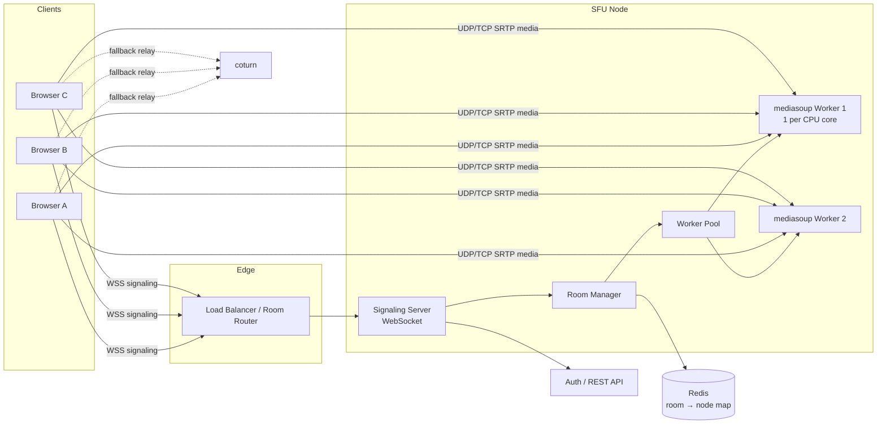
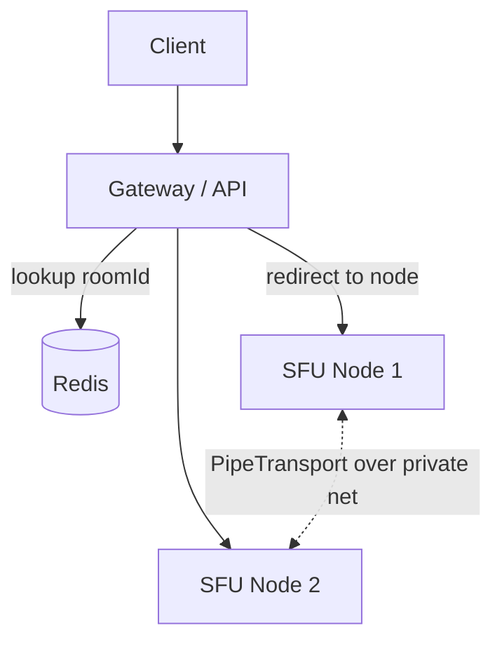

# Building an SFU Server: Architecture & Implementation Guide

**Stack:** Node.js 20+, TypeScript, [mediasoup](https://mediasoup.org) v3, WebSocket (`ws`), Redis (for scaling), coturn (TURN)

---

## 1. What an SFU does

A **Selective Forwarding Unit** receives each participant's media once and forwards it to every other participant, without decoding or mixing it.

| Model | Upload per client | Server CPU | Latency | Best for |
| --- | --- | --- | --- | --- |
| Mesh (P2P) | N-1 streams | none | lowest | 2-4 users |
| **SFU** | **1 stream** | low (packet routing) | low | 3-100s of users |
| MCU | 1 stream | very high (transcode) | higher | legacy/recording |

The SFU's real value: **simulcast / SVC**. Each sender uploads several quality layers, and the SFU picks the right layer per receiver based on their bandwidth.

---

## 2. High-level architecture



**Two planes, kept strictly separate:**

- **Signaling plane** (WebSocket/JSON): join, create transports, produce, consume, leave. Low bandwidth and reliable. Runs in your Node process.
- **Media plane** (RTP/SRTP over UDP): the actual audio/video. Handled by mediasoup's C++ workers, never by your JS code.

---

## 3. Core concepts (mediasoup mapping)

```
Worker            – C++ subprocess, pinned to one CPU core
 └─ Router        – one per room; routes media between its transports
     ├─ WebRtcTransport  – one per client per direction (send / recv)
     │   ├─ Producer     – a track the client is sending (audio/video)
     │   └─ Consumer     – a track the client is receiving
     └─ PipeTransport    – links Routers across workers/nodes
```

Rules of thumb:

- **1 Worker per CPU core.** Rooms are assigned to the least-loaded worker.
- **1 Room = 1 Router**, living on a single worker.
- **2 transports per client** (one send, one recv) keeps negotiation simple and avoids renegotiation glitches.
- **1 Consumer per (receiving peer × remote Producer).**

---

## 4. Project structure

```
sfu/
├── src/
│   ├── index.ts                 # bootstrap
│   ├── config.ts                # ports, codecs, announcedIp
│   ├── media/
│   │   ├── WorkerPool.ts        # create/select workers
│   │   ├── Room.ts              # Router + peers
│   │   └── Peer.ts              # transports, producers, consumers
│   ├── signaling/
│   │   ├── SignalingServer.ts   # WS server, auth, message routing
│   │   └── protocol.ts          # message type definitions
│   ├── cluster/
│   │   └── RoomDirectory.ts     # Redis: room → node
│   └── observability/
│       └── metrics.ts           # Prometheus
├── Dockerfile
└── package.json
```

```bash
npm i mediasoup ws ioredis prom-client zod
npm i -D typescript tsx @types/node @types/ws
```

---

## 5. Implementation

### 5.1 Config

```ts
// src/config.ts
import { types as mt } from "mediasoup";

export const config = {
  port: 3000,
  worker: { rtcMinPort: 40000, rtcMaxPort: 49999, logLevel: "warn" as const },
  codecs: [
    { kind: "audio", mimeType: "audio/opus", clockRate: 48000, channels: 2 },
    { kind: "video", mimeType: "video/VP8", clockRate: 90000 },
    { kind: "video", mimeType: "video/H264", clockRate: 90000,
      parameters: { "packetization-mode": 1, "profile-level-id": "42e01f",
                    "level-asymmetry-allowed": 1 } },
  ] as mt.RouterRtpCodecCapability[],
  transport: {
    listenInfos: [{
      protocol: "udp" as const,
      ip: "0.0.0.0",
      announcedAddress: process.env.PUBLIC_IP,   // REQUIRED behind NAT/cloud
    }, {
      protocol: "tcp" as const,
      ip: "0.0.0.0",
      announcedAddress: process.env.PUBLIC_IP,
    }],
    initialAvailableOutgoingBitrate: 800_000,
    enableUdp: true, enableTcp: true, preferUdp: true,
  },
};
```

### 5.2 Worker pool

```ts
// src/media/WorkerPool.ts
import * as mediasoup from "mediasoup";
import os from "node:os";
import { config } from "../config";

export class WorkerPool {
  private workers: mediasoup.types.Worker[] = [];
  private load = new Map<number, number>(); // worker.pid -> router count

  async init() {
    for (let i = 0; i < os.cpus().length; i++) {
      const w = await mediasoup.createWorker(config.worker);
      w.on("died", () => {
        console.error(`worker ${w.pid} died, exiting for restart`);
        setTimeout(() => process.exit(1), 2000); // let orchestrator restart
      });
      this.workers.push(w);
      this.load.set(w.pid, 0);
    }
  }

  next(): mediasoup.types.Worker {
    const w = this.workers.reduce((a, b) =>
      this.load.get(a.pid)! <= this.load.get(b.pid)! ? a : b);
    this.load.set(w.pid, this.load.get(w.pid)! + 1);
    return w;
  }

  release(w: mediasoup.types.Worker) {
    this.load.set(w.pid, Math.max(0, (this.load.get(w.pid) ?? 1) - 1));
  }
}
```

### 5.3 Room & Peer

```ts
// src/media/Peer.ts
import { types as mt } from "mediasoup";

export class Peer {
  transports = new Map<string, mt.WebRtcTransport>();
  producers  = new Map<string, mt.Producer>();
  consumers  = new Map<string, mt.Consumer>();
  rtpCapabilities?: mt.RtpCapabilities;
  constructor(public id: string, public displayName: string) {}

  close() {
    this.transports.forEach(t => t.close()); // closes producers/consumers too
  }
}
```

```ts
// src/media/Room.ts
import { types as mt } from "mediasoup";
import { config } from "../config";
import { Peer } from "./Peer";

export class Room {
  peers = new Map<string, Peer>();
  private constructor(
    public id: string,
    public router: mt.Router,
    public worker: mt.Worker,
  ) {}

  static async create(id: string, worker: mt.Worker) {
    const router = await worker.createRouter({ mediaCodecs: config.codecs });
    return new Room(id, router, worker);
  }

  async createTransport(peer: Peer) {
    const t = await this.router.createWebRtcTransport(config.transport);
    peer.transports.set(t.id, t);
    t.on("dtlsstatechange", s => s === "closed" && t.close());
    return {
      id: t.id,
      iceParameters: t.iceParameters,
      iceCandidates: t.iceCandidates,
      dtlsParameters: t.dtlsParameters,
    };
  }

  async produce(peer: Peer, transportId: string,
                kind: mt.MediaKind, rtpParameters: mt.RtpParameters) {
    const transport = peer.transports.get(transportId)!;
    const producer = await transport.produce({ kind, rtpParameters });
    peer.producers.set(producer.id, producer);
    producer.on("transportclose", () => peer.producers.delete(producer.id));
    return producer;
  }

  async consume(consumer: Peer, producerId: string, transportId: string) {
    if (!this.router.canConsume({
      producerId, rtpCapabilities: consumer.rtpCapabilities!,
    })) return null;

    const transport = consumer.transports.get(transportId)!;
    // Start paused: client resumes after it's ready (avoids lost keyframes)
    const c = await transport.consume({
      producerId, rtpCapabilities: consumer.rtpCapabilities!, paused: true,
    });
    consumer.consumers.set(c.id, c);
    c.on("producerclose", () => consumer.consumers.delete(c.id));
    return c;
  }

  removePeer(id: string) {
    this.peers.get(id)?.close();
    this.peers.delete(id);
  }

  get empty() { return this.peers.size === 0; }
  close() { this.router.close(); }
}
```

### 5.4 Signaling protocol

All messages are `{ id, type, data }` request/response, plus server-pushed notifications.

| Client → Server | Purpose |
| --- | --- |
| `join { roomId, token, rtpCapabilities }` | Returns router RTP capabilities + existing producers |
| `createTransport { direction: "send"\|"recv" }` | Returns ICE/DTLS params |
| `connectTransport { transportId, dtlsParameters }` | Completes DTLS handshake |
| `produce { transportId, kind, rtpParameters }` | Returns `producerId` |
| `consume { producerId, transportId }` | Returns consumer params |
| `resumeConsumer { consumerId }` | Starts media flow |
| `leave {}` | Cleanup |

| Server → Client (push) | Purpose |
| --- | --- |
| `newProducer { peerId, producerId, kind }` | Someone started sending |
| `producerClosed { producerId }` | Someone stopped |
| `peerLeft { peerId }` | Remove UI tile |

```ts
// src/signaling/SignalingServer.ts (core of the message router)
import { WebSocketServer } from "ws";

export function startSignaling(server, rooms: RoomRegistry) {
  const wss = new WebSocketServer({ server });

  wss.on("connection", (ws, req) => {
    let room: Room | undefined, peer: Peer | undefined;
    const reply = (id: string, data: unknown) => ws.send(JSON.stringify({ id, data }));
    const push  = (p: Peer, type: string, data: unknown) =>
      (p as any).ws?.send(JSON.stringify({ type, data }));

    ws.on("message", async (raw) => {
      const { id, type, data } = JSON.parse(raw.toString());
      try {
        switch (type) {
          case "join": {
            const claims = verifyJwt(data.token);               // auth FIRST
            room = await rooms.getOrCreate(data.roomId);
            peer = new Peer(claims.sub, claims.name);
            (peer as any).ws = ws;
            peer.rtpCapabilities = data.rtpCapabilities;
            room.peers.set(peer.id, peer);
            const existing = [...room.peers.values()].flatMap(p =>
              [...p.producers.values()].map(pr => ({
                peerId: p.id, producerId: pr.id, kind: pr.kind })));
            return reply(id, {
              routerRtpCapabilities: room.router.rtpCapabilities, existing });
          }
          case "createTransport":
            return reply(id, await room!.createTransport(peer!));
          case "connectTransport":
            await peer!.transports.get(data.transportId)!
              .connect({ dtlsParameters: data.dtlsParameters });
            return reply(id, {});
          case "produce": {
            const pr = await room!.produce(peer!, data.transportId,
                                           data.kind, data.rtpParameters);
            room!.peers.forEach(p => p !== peer && push(p, "newProducer",
              { peerId: peer!.id, producerId: pr.id, kind: pr.kind }));
            return reply(id, { producerId: pr.id });
          }
          case "consume": {
            const c = await room!.consume(peer!, data.producerId, data.transportId);
            if (!c) return reply(id, { error: "cannot consume" });
            return reply(id, { consumerId: c.id, producerId: c.producerId,
                               kind: c.kind, rtpParameters: c.rtpParameters });
          }
          case "resumeConsumer":
            await peer!.consumers.get(data.consumerId)!.resume();
            return reply(id, {});
        }
      } catch (e: any) { reply(id, { error: e.message }); }
    });

    ws.on("close", () => {
      if (room && peer) {
        room.removePeer(peer.id);
        room.peers.forEach(p => push(p, "peerLeft", { peerId: peer!.id }));
        if (room.empty) rooms.close(room.id);
      }
    });
  });
}
```

### 5.5 Client flow (browser, `mediasoup-client`)

```
1. WS connect → join                      → get routerRtpCapabilities
2. device.load({ routerRtpCapabilities })
3. createTransport(send) + createTransport(recv)
4. sendTransport.on("connect") → connectTransport
   sendTransport.on("produce") → produce → callback({ id })
5. getUserMedia → sendTransport.produce({ track, encodings: [simulcast] })
6. On newProducer (and for `existing`): consume → recvTransport.consume() →
   attach track to <video> → resumeConsumer
```

Simulcast encodings for video:

```ts
encodings: [
  { rid: "r0", maxBitrate: 100_000, scaleResolutionDownBy: 4 },
  { rid: "r1", maxBitrate: 300_000, scaleResolutionDownBy: 2 },
  { rid: "r2", maxBitrate: 900_000 },
]
```

---

## 6. Bandwidth adaptation

mediasoup does server-side BWE (transport-cc) automatically and switches simulcast layers per consumer. You control the policy:

- **Active speaker:** use `AudioLevelObserver` on the Router; request high layer only for the speaker (`consumer.setPreferredLayers({ spatialLayer: 2 })`), low for the rest.
- **Large rooms / pagination:** only create Consumers for visible tiles. Pause others (`consumer.pause()`).
- **Congestion:** listen to `consumer.on("score")`, and drop to audio-only if the score is persistently low.

---

## 7. Scaling

### Level 1: Vertical (single node)

Multiple Workers, one Room per Router. A 8-core node typically handles \~500-1000 consumers (depends on bitrate and codec).

### Level 2: Large single rooms (webinars)

One Router can saturate a core. Use `router.pipeToRouter()` to fan out a Producer to Routers on other Workers; viewers are spread across them.

### Level 3: Horizontal (multi-node)



- **Room affinity:** a room lives on one node. The gateway stores `room:{id} → nodeUrl` in Redis (with TTL, refreshed by the node).
- **Node selection** for new rooms: lowest `(consumers / capacity)` reported via heartbeat.
- **Cascading** (only for huge rooms or geo-distribution): link nodes via `PipeTransport` over a private network.

---

## 8. Deployment checklist

- **Ports:** open `UDP+TCP 40000-49999` (media), `443` (WSS), and `3478/5349` (TURN).
- **`announcedAddress`** must be the **public IP**; the #1 cause of "connects but no video".
- **Docker:** use `network_mode: host` (mapping thousands of UDP ports through Docker NAT is slow and fragile).
- **TURN (coturn):** required for \~10-15% of users behind symmetric NAT / strict firewalls. Use short-lived credentials (REST API shared secret).
- **TLS:** terminate WSS at nginx/Caddy; media is already encrypted (DTLS-SRTP).
- **Instance type:** compute-optimized, high network bandwidth. Egress is your biggest cost: estimate `consumers × bitrate`.

---

## 9. Security

- Authenticate with a **short-lived JWT** at `join` (signed by your API; contains `roomId`, `userId`, `role`).
- Enforce **role permissions** server-side (can this peer produce? screenshare?). Never trust the client.
- Validate every message with **zod** schemas; cap message size and rate-limit per socket.
- Limit producers per peer and total peers per room.
- Keep mediasoup workers unprivileged; run as non-root.

---

## 10. Observability

Export via `prom-client`:

| Metric | Why |
| --- | --- |
| rooms, peers, producers, consumers (gauges) | capacity planning |
| per-worker CPU (`worker.getResourceUsage()`) | rebalancing |
| `transport.getStats()` → bitrate, RTT, packet loss | quality monitoring |
| `consumer.on("score")` histogram | user-perceived quality |
| WS connect/disconnect, join latency | signaling health |

Alert on: worker death, CPU > 70% sustained, egress near NIC limit, join error rate.

---

## 11. Recording (optional)

Don't record inside the SFU process. Create a `PlainTransport` + `consume` on the Router, send RTP to an **FFmpeg** or **GStreamer** process (via an SDP file), and write to HLS/MP4. This isolates failures and CPU.

---

## 12. Build order (suggested roadmap)

1. **Day 1-2:** WorkerPool, Room, Peer, basic signaling, 2-person call.
2. **Day 3:** Multi-party, `newProducer` / `peerLeft` push events, cleanup paths.
3. **Day 4:** Simulcast + active speaker + paused consumers.
4. **Day 5:** JWT auth, validation, metrics, Docker + coturn.
5. **Week 2:** Redis room directory, multi-node, load tests (e.g. `mediasoup-client` headless bots / `mediasoup-load-test`).
6. **Later:** Recording, pipe-to-router for large rooms, TWCC tuning.

---

## 13. Alternatives

| Option | Pick it if |
| --- | --- |
| **mediasoup** (this doc) | You want a library and full control of signaling/architecture |
| **LiveKit** (Go, Pion) | You want a batteries-included server with SDKs, built-in scaling |
| **Janus** | You want a C plugin-based gateway |
| **Pion** (Go) | You want to write the SFU from scratch in Go |